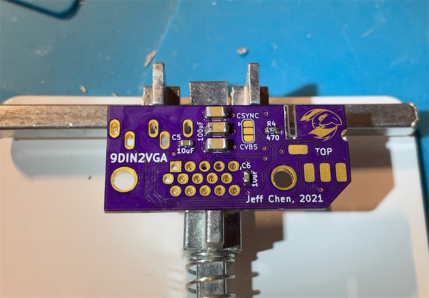

# 9DIN2VGA

 

A dongle for consoles with 9 pin Mini DIN RGBs video output.

-----------

This adapter allows you to plug into consoles that output RGBS and stereo audio via a 9 pin Mini DIN jack and transmits the signals through a VGA cable. This includes but not limited to:
- Sega Genesis/Mega Drive 2
- Sega Genesis/Mega Drive 1 with the [Triple Bypass mod](https://github.com/tianfeng33/triple-bypass-Version-2)
- TerraOnion SSDS3
- [3DORGB](https://github.com/citrus3000psi/3DORGB) with 9 pin mini DIN option

 
 

The default sync signal used in this design is CSync. If you prefer composite video as sync, you can change it via the jumper by cutting the default connection and soldering the CVBS end in.

 Audio can be sent within the VGA cable, or extracted from the 3.5mm jack on the dongle. Buzzing may be noticeable when audio is transmitted through the VGA cable in certain scenes in certain games. This is due to insufficient shielding in most VGA cables. If you find the buzzing to be annoying, please use the 3.5mm jack on the dongle for audio output. This will ensure the cleanest possible audio.

-----------

## Parts

9 pin Mini DIN Male Plug (Choose the 9PIN option)
- https://www.aliexpress.com/item/4000139817115.html

PCB
- Main: https://oshpark.com/shared_projects/VMGQWaYo
- Top Sub (0.8mm): https://oshpark.com/shared_projects/PPJPpJ3M
- Bottom Sub (0.8mm): https://oshpark.com/shared_projects/QY4wR3iT

  **Note the Top & Bottom sub boards MUST be ordered with the 0.8mm thickness option, otherwise they won't fit!**

VGA Port Slim Female
- https://www.aliexpress.com/item/4000596805684.html

3.5mm Headphone Jack PJ-325
- https://www.aliexpress.com/item/1005002983859846.html

Components:
- [4x] SMD Capacitor 220uF 6.3V X5R, 1206 size
- [2x] SMD Capacitor 10uF 6.3V, 0603 size
- [1x] SMD Resistor 470 Ohm, 0603 size
- [4x] SMD Resistor 75 Ohm, 0603 size

[2x] M2x20mm and [1x] M2x6mm screw and hex nut
- https://www.amazon.com/gp/product/B014OO5KQG

-----------
## Print

Print the parts with the mating surface downwards, with support.

-----------
## Assembly

(Borrowing some pictures from the [8DIN2VGA Plug Type](https://github.com/jeffqchen/8DIN2VGA/tree/main/8DIN2VGA_Plug) guide)

### Disassemble The Plug First

Take apart the 9 pin mini DIN connector by removing the rubber outer casing, and then splitting the hard plastic inner casing to reveal the metal shielding. You may discard the rubber and plastic parts.

Then, use a pair of pliers to slightly open up the rear end of the metal barrel shielding, while pushing the plug core (black plastic with the pins) inward with another tool from the front, to remove the core from the metal shielding.

Do **NOT** spread the metal shielding by too much or you'll have to spend some time to bend it back into it's original shape afterwards.

You may also want to take this chance to slightly sand the left and right side of the outside of the metal shield, around the rear end, so it will be easier for solder to stick to the shielding later.

---------------

Soldering the plug PCBs in this project is essential and somewhat challenging. This applies to soldering the sub boards to the pin header, as well as the landing pads on the main PCB. If you leave any gap, the assembly will not fit and the shells won't close properly.

**DO NOT solder the plug PCBs to the main PCB at this stage.**

First, temporarily assemble the 3 boards together into their final position, and fix the assembly with the help from a pair of reverse tweezers or clamps. Fit the 0.8mm PCBs in between the gaps between the back side of the 3 rows of pins. Push the sub PCBs all the way until they touch the base of the pin. Make sure the pins and their pads are aligned properly.

 ----

**IMPORTANT**

 *The plastic of the plug core is weak against heat and should not be heated for more than a few seconds in one go. Try to cool it down between soldering by blowing air on it.*

 ----

 Solder the two pins on the bottom side of the **bottom** PCB with proper amount of solder. Then release the clamping and remove the top and main PCB. Proceed to solder the center row of the pins to the **bottom** PCB.

  

 Again, put everything back together with clamping. Then, solder the **top** PCB to the **top** row of the pin header. Now, release the clamping and remove only the main PCB. The assembly should look as follows:

 

 Shove the plug core - PCB assembly into the metal barrel shielding from the back, push it all the way in. Be careful and don't bend the PCB and damage the assembly.

 Fit the main PCB firmly into the shell and the plug and see if all the landing pads line up correctly:

 
 

------

On the main PCB, solder in all the SMD components, as well as the headphone jack. Do **NOT** solder in the VGA plug yet.

After soldering the headphone jack, use a side cutter to trim the protruding leads from it.

Tin the L-shape exposed area with a small amount of solder on both sides.

Note the default configuration of this adapter uses the CSync signal for sync. If you wish to use composite video for sync, you need to cut the connection between the triangle end and the center pad of the jumper, and then solder the CVBS pad with the center pad. You can also omit one of the 220uF capacitor for the sync line and the 470 Ohm resistor in this configuration, since they exist to decouple and attenuate the CSync signal.

------

### Plug Insertion

Insert the plug assembly into the inner side of the 3D printed shell. Align the hole on the shielding with the hole on the top side of the inner shell.

Trim the thread end of a M2x6mm machined screw so that its total length is 5.5mm (no more than 6mm). You may want to re-tap the end of the trimmed screw with a nut before moving onto the next step, since it's will make the next step a bit smoother.

Use a pair of tweezers, hold the nut and slide it inside the shielding cavity without letting go. Align the hole of the nut with the hole on the shell. With the other hand, put the screw in with a screw driver and screw into the nut. Screw all the way in until the screw is snug.

Check and make sure the end of the screw is **NOT** touching the plug PCB.

-----

### Main PCB Soldering

Again, insert the main PCB into its final position. Pinch the two sub boards into the main with a clamp or reverse tweezers. Make sure there's no gap between the sub and main PCB. Then, solder all the landing pads with proper amount of solder.

Then, use ample amount of solder to attach the metal shield of the plug to the exposed copper area onto both sides of the main PCB. There are a total of four points to solder to the shielding. Make sure you don't apply too much heat for too long, or you might warp the 3D printed case.

Last, solder in the VGA port and trim the shielding prongs with a side cutter.

Soldering is finished.

------

### The End

Take a M2 screw, screw a nut onto it, and use the screw as a handle to push the nut into the nut slot on inner shell.

Then, slide the outer shell into position with inner shell and put in two M2x20mm screws to close up the shell.

